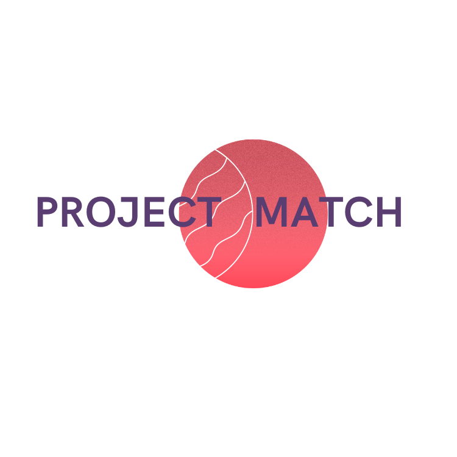

# Project Match - SPRINT 1

For our project this week, we had to create an application that would enhance the experience 
or solve a problem a bootcamper on a coding bootcamp might face.  

From our discussion, which we used to create our user personas, 
we found the common problem that we have all found. As we are all new to the tech industry,
it can be overwhelming to try work on projects independently. Our platform would be a social environment 
to enable people to connect and collaborate on projects together.

This is our MVP, so all you can do is search for projects by stack, and also post a project.




## Color Reference

| Color             | Hex                                                                |
| ----------------- | ------------------------------------------------------------------ |
| Highlight Pink |#f36471 |
| Neutral Pink | #f3a2a9|
| Second HighLight Purple | #959ce8 |
| Neutral White  |#fff7f8 |
| Dark Text  | #3F403F|


## Run Locally

Clone the project

```bash
  git clone https://github.com/SchoolOfCode/bc13_w9_project-frontend-madt
```

Go to the project directory

```bash
  cd my-app
```

Install dependencies

```react
  npm install
```

Start the server

```bash
  npm start
```


## Authors

- [Marwa Dawood](https://github.com/MarwaDawood)
- [Daniel Ballie](https://www.github.com/cmndgrab)
- [Amina Edmunds](https://www.github.com/edmundsamina)
- [Tirso Garcia](https://github.com/Tirsog)


## Acknowledgements

 - [Awesome Readme Templates](https://awesomeopensource.com/project/elangosundar/awesome-README-templates)
 - [LOGO](https://www.canva.com/)


# Project Match - SPRINT 2 - COMPLETE DESIGN OVERHAUL - *IN PROGRESS*

The goal of this sprint is to improve the UI/UX experience, and seperate the app into multiple pages. The one page app will turn into 3 seperate pages, a landing page, a search page and a page where users can post looking for someone to collaborate on the project.


## Authors

- [Amina Edmunds](https://www.github.com/edmundsamina)


# Project Match - SPRINT 3 *PENDING*

The goal of this sprint is to add extra functionality to this project. Some features that will be added are -> 

- Register
- Log In
- Log Out 
- Edit Post 
- Delete Post
- Edit Profile


## Authors

- [Amina Edmunds](https://www.github.com/edmundsamina)
